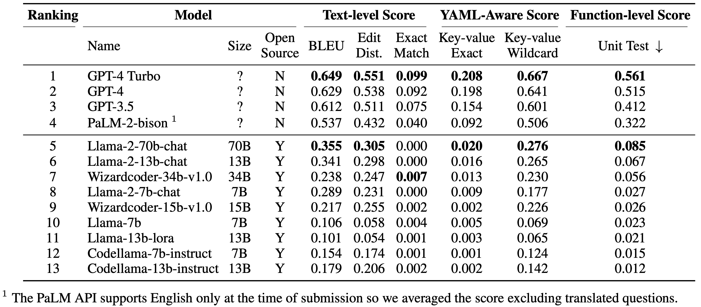

# ☁️ CloudEval-YAML

🤔 Considering integrating LLMs into your cloud application but unsure about their performance? Check this out 👇



📊 The table is generated with CloudEval-YAML, a practical Large Language Model (LLM) benchmark specifically designed for cloud-native application configuration generation. It comprises a comprehensive dataset of 1011 problems covering widely deployed applications including Kubernetes, Envoy and Istio. This benchmark is unique in its practical and realistic approach, featuring a combination of hand-written question contexts, reference YAML files, and unit test scripts for each problem. This benchmark can facilitate comparing different LLM models, as well as different sampling and prompt engineering techniques. 
📄 Please refer to the following technical report for more detailed information:
[*A Practical Benchmark for Cloud Native YAML Configuration Generation*](assets/cloudeval-yaml.pdf).

## 🚀 Quick Start

Benchmarking GPT-3.5 with all metrics but unit tests.

#### 📋 Prerequisites:

Install the python prerequisites

  ```bash
  pip install -r requirements.txt
  ```

#### 🔑 Configure OpenAI API Key
  ```bash
  export OPENAI_API_KEY='YOUR_API_KEY'
  ```

#### 🏃 Run the Benchmark
  ```bash
  python benchmark.py
  ```
  Sample output from the terminal:
  ```log
  ------ Problem: Kubernetes_pod_q1 ------
  bleu score: 0.69 / 1
  edit_distance score: 0.57 / 1
  exact_match score: 0.00 / 1
  kv_match score: 0.00 / 1
  kv_wildcard score: 0.73 / 1

  (more problems...)

  ------ Category: Kubernetes_pod ------
  bleu score: 30.44 / 48
  edit_distance score: 23.60 / 48
  exact_match score: 4.00 / 48
  kv_match score: 10.00 / 48
  kv_wildcard score: 28.83 / 48

  (more categories...)
  
  ------ Overall --- Model: gpt-3.5 ------
  Dataset: original (337 problems)
  bleu score: 211.66 / 337
  edit_distance score: 174.34 / 337
  exact_match score: 29.00 / 337
  kv_match score: 58.00 / 337
  kv_wildcard score: 212.39 / 337

  (repeat above: more datasets...)

  ====== Overall === Model: gpt-3.5 ======
  Dataset: original, simplified, translated (1011 problems)
  bleu score: 0.631
  edit_distance score: 0.522
  exact_match score: 0.071
  kv_match score: 0.154
  kv_wildcard score: 0.605
  ```
  All prompts, generated codes and scores by default will be saved in `outputs/`. You man use them as checkpoints for further analysis.
  
#### 🎉 Congratulations! You have successfully completed the quickstart and benchmarked GPT-3.5 (other than unit tests).

## 🤖 Benchmarking Different Models

### OpenAI GPT-3.5/4
* Configure OpenAI API key
  ```bash
  export OPENAI_API_KEY='YOUR_API_KEY'
  ```
* Include GPT-3.5/4 for benchmarking in `config.json`
  ```json
  "models": [
    "gpt-3_5",
    "gpt-4"
  ]
  ```
* Model-specific query is defined in [`models/gpt.py`](models/gpt.py). You may customize them if needed. Please refer to [OpenAI API documentation](https://platform.openai.com/docs/api-reference/chat) for more details.

### Google PaLM 2
* Configure PaLM API key
  ```bash
  export PALM_API_KEY='YOUR_API_KEY'
  ```
* Include PaLM 2 for benchmarking in `config.json`
  ```json
  "models": [
    "palm-2"
  ]
  ```
* Model-specific query is defined in [`models/palm.py`](models/palm.py). You may customize them if needed. Please refer to [Google API documentation](https://developers.generativeai.google/api/python/google/generativeai) for more details.


### Replicate
[Replicate](https://replicate.com) is a platform that allow you to run open-source or your own models at scale in the cloud. It abstracts away the complexity of deploying models locally and provides a simple API for query and response.

* Configure Replicate API token
  ```bash
  export REPLICATE_API_TOKEN=='YOUR_API_TOKEN'
  ```
* Currently, a subset of supported open-source models are integrated into the benchmark. You may include them for benchmarking in `config.json`.
  ```json
  "models": [
    "llama-2-70b-chat",
    "llama-2-13b-chat",
    "llama-2-7b-chat",
    "llama-13b-lora",
    "llama-7b",
    "wizardcoder-34b-v1.0",
    "wizardcoder-15b-v1.0",
    "codellama-13b-instruct",
    "codellama-7b-instruct"
  ]
  ```
* Model-specific query is defined in [`models/replicate.py`](models/replicate.py). You may customize them, integrate more or even include your own models if needed. Please refer to [Replicate API documentation](https://replicate.com/docs) for more details.

## 🏃 Run the Unit Tests

The easiest way to run unit tests is to launch an AWS EC2 instance using public AMI with `cloudyaml_public` as name and `ami-012306c17129a3b71` as ID. Notice that this is going to take several hours to evaluate. Alternatively, one can create a pull request and we can help to run on a cluster.

After launching the EC2 instance, you can pull this repo and enable unit test in `config.json`

```json
"metrics": {
  "unit_test": true
}
```

Then run the benchmark:

```bash
python benchmark.py 
```

Sample output from the terminal:

  ```log
  ------ Problem: Kubernetes_pod_q1 ------
  bleu score: 0.69 / 1
  edit_distance score: 0.57 / 1
  exact_match score: 0.00 / 1
  kv_match score: 0.00 / 1
  kv_wildcard score: 0.73 / 1
  unit_test score: 1.00 / 1

  (more problems, categories and datasets...)
  
  ====== Overall === Model: gpt-3.5 ======
  Dataset: original, simplified, translated (1011 problems)
  bleu score: 0.631
  edit_distance score: 0.522
  exact_match score: 0.071
  kv_match score: 0.154
  kv_wildcard score: 0.605
  unit_test score: 0.418
  ```

Please refer to [Advanced.md](Advanced.md) for how to run your own model and other advanced features.

## 📄 Citation
If you find this benchmark useful, please cite our paper:
```
@article{xu2023practical,
  title={A Practical Benchmark for Cloud Native YAML Configuration Generation},
  author={Yifei Xu, Yuning Chen, Xumiao Zhang, Xianshang Lin, Pan Hu, Yunfei Ma, Songwu Lu, Wan Du, Z. Morley Mao, Ennan Zhai, Dennis Cai},
  year={2023}
}
```
